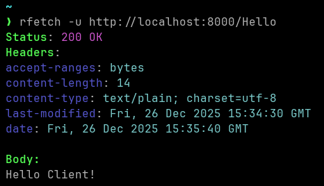
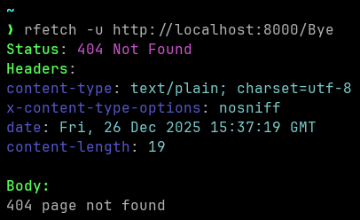
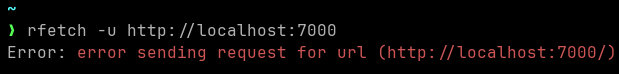

# RFetch
CLI HTTP Client written in Rust.

## What is this project about?
RFetch is a simple but ergonomic CLI-Based HTTP Client. Functionally, it is similar to curl but with more understandable flag arguments and prettier output.

## Examples
To send a simple GET Request without a body:
```bash
rfetch -u http://localhost:8080/
```

To send a POST request with a JSON body: 
```bash
rfetch -u http://localhost:8080/ -m POST -j -b '{"mykey": "MyValue"}'
```

To send a PUT request with headers:
```bash
rfetch -u http://localhost:8080/ -m PUT -H myheader:myvalue -H myotherheader:myothervalue
```

## Output
### Successful GET Request


### Error response from server


### Error while sending request


## Flags:
| ```-u``` | ```-j``` | ```-b``` | ```-m``` | ```-H``` | ```-o``` | ```--debug``` | 
|----------|----------|----------|----------|----------|----------|---------------|
| URL      | JSON     | Body     | Method   | Header   | Output   | Debug/Verbose |

## Compilation
First, clone this repository
```bash
git clone https://github.com/Moritisimor/rfetch
```

Then, cd into the source code folder
```bash
cd rfetch/src
```

And finally compile it with cargo
```bash
cargo build -r
```

The binary will be in ```rfetch/target/release``` and is called ```rfetch```
